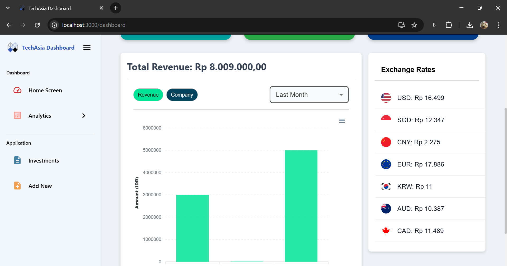
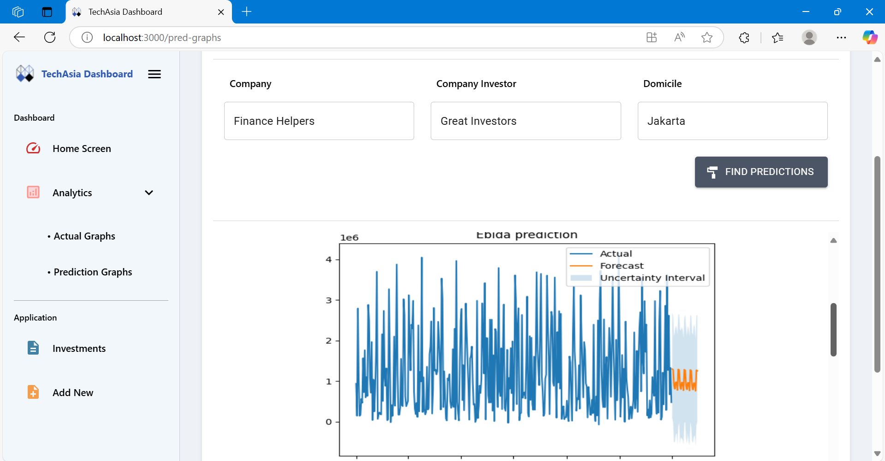

# Capstone-Project
Dependencies:

Client side:

Firebase || 
Axios || 
@mui
@emotion ||
@nivo ||
@testing-library ||
Date-fns ||
React ||
React-dom ||
React-router-dom ||
React-firebase-hooks ||
React-toastify ||
React-scripts ||
Bootstrap ||
Boxicons

Server side:

Dotenv ||
Mongoose ||
Cors ||
express ||

Pip modules:

requests ||
json ||
pandas ||
Prophet ||
matplotlib

Things to note:

-Both the application and the database is localhost and not published 

-Authentication uses firebase which the key is not available in the repository and can be placed in the client directory using a .env file

-Access to the people able to access the database is only allowed by giving access directly through firebase

-Pip modules may not be downloaded when running the app, if not in the terminal run the command ”pip install -r pip_requirements.txt”

How to run:
Create a docker container that has the port to mongo db install it
Go to the server using “cd server” and use “npm i” to install dependencies
Then use “npm run dev” to start the server 
In another terminal Go to the client using “cd client” and use “npm i” to install dependencies
Then use “npm start” to start the client

User interface and user manual:

Upon entering the system the user is being greeted by the login page which will need the authentication from the user that exist in the firebase database.

When you enter the system, you will be greeted with the dashboard page where you can go to the other pages using the side bar. Logout button available in the top bar

in the investments page you can see all of the records that are in the database. You can sort the values by its order. On the right side of each row, you can edit or delete the data

when clicking the update form, the user will be redirected to another page with the values of the previous results shown

The layout for adding a new form is similar to updating the form. To access the new form page, the user clicks on the add new on the side bar

To check the status of each company, the user can check for graphs under analytics and click on the actual graphs.

User can select the criteria that is being asked such as how many days previous is needed to be seen.

For seeing the prediction results, a user can go to the prediction graphs under analytics.

The user needs to input what is the criteria they want to see the trend by typing the Company Name, the Investor and the Domicile

*note: prediction uses random data and not a trend like dummy data so the extremes are shown through uncertainty interval*

